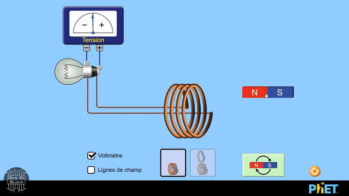

---
Imaginez un monde où les ennemis de la sécurité ne cherchent plus à briser les clés, mais à les contourner subtilement, comme des espions rus(s)és cherchant à glaner des informations confidentielles. 

## **Introduction**

Bienvenue dans le monde des side channels, où les secrets ne sont pas seulement trouvés, mais écoutés, observés et même ressentis.  Bien que communément connus pour être liés à l'informatique, les sides-channels permettent de mettre en lumière des facettes fascinantes dans divers secteurs, allant des sciences comportementales jusqu’au génie civil ( *sentez la hype monter en vous* ).  L'idée de l'exploitation de ces canaux latéraux est similaire à celle de l'esprit d'un hacker : **trouver des failles ou des vulnérabilités dans un système pour y intéragir de manière non conventionnelle**.

Trève de bavardage!  Au fil des articles, j’aborderai les différents types de side channels, en explorant leur fonctionnement via des exemples concrets d'attaques de plus en plus axé sur le secteur cryptanalystique. Enfin je finirai par vous parler de **Deep-Learning et de son potentiel incroyable d'exploitation de canaux auxialiaire**. Alors que vous soyez un professionnel de la sécurité informatique, un passionné de cryptographie ou simplement curieux de découvrir les secrets de cet univers complexe, cette série d'articles est faite pour vous. 

### Et donc, qu'est-ce que c'est ?

Les attaques par canaux auxiliaires sont **des moyens indirects permettant une interaction/observation en exploitant les caractéristiques comportementales d'un système**.  Quèsako ? En fait il faut comprendre qu'un système, aussi complexe soit-il ( qu'il s'agisse d'une poutre, d'un dindon, d'un ordinateur ou d'un humain), possède **des propriétés physiques, électromagnétiques, acoustiques, ou encore temporelles** (et bien d'autres), sans que ces derniers en soient fondamentalement conscients. 

En d'autres termes, **chaque système émets des informations non-volontaires qui lui sont propres**, que nous qualifierons donc par la suite de **fuite**. 

## **Observation** vs **Interaction**

Vous noterez que je ne qualifie pas encore les sides-channels d'*exploitation* ou d'*attaque* d'un système, mais bien d'une **interaction** ou alors d'une **observation**, tout simplement car avant avant de compromettre un système nous aurons toujours besoin de l'observer et/ou d'y interagir.
#### Mais alors comment cela ce concrétise réellement? 

Nous différencions 2 grandes familles d'attaques via canaux auxialiares :
 - **Les attaques invasives** ( via une interaction )
 - **les attaques non-invasives** ( via une observation )
 
 Les attaques non-invasives se contentent de rester extérieures au système, en analysant généralement son comportement. Contrairement aux attaques invasives qu'ils elles sont beaucoup plus risquées et techniques, car intéragissent avec le système, dans le but d'en modifier le comportement.

## **Analogies**

Pour illustrer mes propos et vous démontrer que ce domaine d'attaque ne se cloisonne pas qu'à l'informatique, voici quelques exemples parlant :

### Les Sciences comportementales

Question: **Quelles propriétés humaines permettent d'identifier un individu ?**

Vous me répondrez sans aucun doute le nom / prénom, les empreintes digitales, l'ADN, les traits du visage... Et vous avez raison, malheureusement le but ici est de faire une analogie entre canaux auxialiaires et sciences comportementale.  


Donc en 2018 des chercheurs chinois se  sont posée cette question, et vous connaissez j'en suis sûr la solution qu'ils ont trouvés ; ils découvrairent une **corrélation** entre la démarche d'un humain et de son identité, permettant de relier démarche et identité, et donc d'exploiter un canaux auxiliaire humain, cqfd. ( Si vous voulez approndir je vous conseille [cet article](https://www.exer.ai/posts/gait-recognition-using-deep-learning-to-collect-better-data) ).  
> Dans ce contexte, la corrélation est généralement calculée via du **Deep Learning**, un article y sera dédié alors ne vous en faites pas si vous ne connaissez pas cette technologie ! 

Vous pouvez appliquer ce concept dans plusieurs domaines semblables, comme la **communication non-verbale**, la **PNL**, l'**hypnose** ( bien que contrairement aux autres, l'hypnose serait plutôt catégorisé comme **exploitation invasive**, car nécéssite une interaction )

### La géotechnique

Déjà qu'est-ce que la géotechnique ? 

*"La géotechnique est la technoscience consacrée à l’étude pratique de la subsurface terrestre sur laquelle notre action directe est possible pour son aménagement et/ou son exploitation, lors d’opérations de BTP (génie civil, bâtiment, carrières)[...]"*

Bon en gros c'est l'étude du terrain / infrastructures pour résister à des risques naturels, comment pourrions-nous attaquer via canaux auxialiaires dans ce contexte...?
Bien prenons un pont, il résiste au vent, à l'humidité, aux crue et même à de lourdes charges, tout le savoir faire des ingénieurs de l'époque. Maintenant faites traverser des centaines de soldats marchants au pas, vous savez ce qu'il risque de se passer ? Le rythme des pas du bataillon, frappant et choquant, crée une **fréquence** qui, si elle rentre avec celle de **résonance** du pont, peut le faire s'éffondrer en quelques minutes. L'exemple le plus connu est celui du pont de la Basse-Chaîne à Angers qui a coulé après le passage de 200 soldats.

Nous parlons donc d'**attaque par fréquence de résonance**, qui est, vous vous le doutez bien, une attaque (très) invasive. Vous pouvez comparer ce phénomène au fonctionnement d'un diapason ou à la Castafiore qui brise des verres en chantant .

## **Exemples d'attaques**

Fini les analogies exotiques et rentrons dans le domaine de l'informatique, comme vous l'avez vu il est impossible de faire une liste exhaustive de toute les attaques connues et possibles, en voici quelques-unes que j'apprécie tout particulièrement :

### Keylogger

Un keylogger est un programme permettant d'enregistrer les frappes d'un clavier à l'insu de l'utilisateur. D'un point de vu des side-channels, on peut s'apercevoir que **chaque touche** d'un clavier émet un son infiniment différent les unes des autres, il deviens alors possible avec les bonnes connaissances et un micro, d'enregistrer les frappes d'un clavier à distance, je vous laisse à cette vidéo qui traite le sujet plus en profondeur ( via du deep-learning notamment... :eyes: )



### Destruction de disque dur

Et à distance en plus !! J'espère que vous vous souvenez des fréquences de résonances, alors pourquoi ne pas trouver la fréquence de résonance d'un disque dur, et de jouer cette fréquence via les haut parleurs du PC ? Bien que rare, c'est possible sur certains modèles de disques durs précis, et mieux que ça, certaines musiques célèbres permettent de les détruires pour vous. Voici [une CVE](https://cve.mitre.org/cgi-bin/cvename.cgi?name=CVE-2022-38392) ( une vulnérabilitée publique ) trouvée en 2022, qui dévoile la possibilité de détruire des disques dur via la simple lecture de [Janet Jackson - Rhythm Nation](https://www.youtube.com/watch?v=OAwaNWGLM0c)  (à vos risques et périls) 

### Récupération du flux vidéo

Bien qu'un peu plus technique, cette attaque est pourtant très facile à mettre en place et me permet de vous introduire : 

:star: **Les émissions électromagnétiques (EM)** :star:

Pour ceux qui auraient oubliés leurs cours de physique élémentaire, voici un bref résumé :

- Les champs électromagnétiques sont des champs qui se propagent dans l'espace et qui sont créés par des charges électriques en mouvement. Ils se composent d'un champ électrique et d'un champ magnétique

- Le champs électrique est lié à la **tension**, et est généré dès lorsque qu'on branche un appareil, se mesuré en Volt par mètre (V/m)

- Le champ magnétique est lié au **courant**, et est généré quand du courant est consommé, se mesure en Tesla (T)

Et donc si nous prenons un aimant, qui produit naturellement un champs magnétique statique en permanance, et que nous le passons dans un champs électrique fermé, par exemple une bobine de cuivre, les deux rentrent en interaction et produisent de l'énérgie ! Magnifique non ? 

*Merci à [Deus Ex Silicium](https://www.youtube.com/@dexsilicium) pour le visuel :)*

Tout ça pour vous faire comprendre qu'il y a une **corrélation** entre la quantité de courant utilisé par un circuit et sa quantité d'émissions électromagnétique généré. Qu'est ce qu'on peu faire avec ça ? Et bien beaucoup de choses, notamment récupérer l'image d'un écran à plusieurs mètres...

L'attaque **Tempest** est une attaque ciblant spécifiquement les EM, initialement utilisé par la NSA qui lui donna le nom de code *Tempest*, cette attaque consiste à relever & analyser les fuites EM d'un système. Au fil des années, ces attaques se sont répandues au grand public et sont maintenat très facile à mettre en place. 

L'idée est d'effectuer du **eavesdropping** ( comprenez de l'écoute clandestine ) via des antennes radio sur un système, généralement des câbles ou écrans traitants des informations sensibles. En effet les câbles ( HDMI, USB, ... ) agissent naturellement comme des antennes et produissent donc des émanations EM directement en fonction des informations binaires qui passe dedans ( souvenez-vous, **corrélation entre quantité de courant et quantité d'émissions électromagnétique** ). Sois basiquement:
- Si 0 passe dans le câble alors pas d'émission EM
- Si 1 passe dans le câble alors émission EM

A partir de la nous pouvons donc reconstruire à partir du flux EM tout ce qui passe par le câble, en connaissant le protocole utilisé bien évidemment. Voici quelques petites démonstrations :





## **Et la suite ?**

D'un point de vue sécurité, il vous semblera très certainement **difficile de remédier** à ce genre de vecteurs d'attaques, et vous avez raison. Les sides channels sont aujourd'hui **généralement découvert par erreur**, ce qui rend la détection volontaire d'une fuite très peu courante. Malgré les différentes recherches menées sur ce sujet, il existe certainement aujourd'hui des attaques par canaux auxiliaires très efficace gardés secrète par des états ( Oyez, complotistes ! ).
Plus sérieusement, historiquement ces vecteurs sont très couramment utilisés de **manière étatique** (lors de guerre ou d'espionnage), nous avons parlé du Tempest mais il existe encore une grande panoplie de techniques rendues publique, donc je n'imagine même le nombre gardés confidentielles...

J'espère que ce premier article vous as plû, qu'il vous a donné des idées et fait prendre conscience des potentielles vulnérabilités invisibles auquelles nous sommes confrontés chaques jours. Les prochains articles serons orientés **cryptanalyse**, et donc beaucoup plus technique, mais ne vous inquiétez pas, on ira crescendo !
